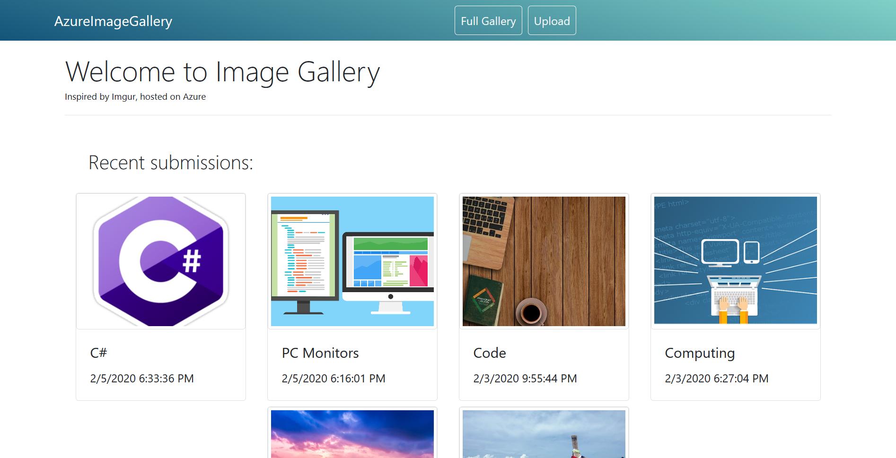

# Azure Image Gallery

> Image gallery with file hosting on Azure

## Scope

An image gallery using ASP.Net Core MVC that connects to an Azure blob storage, where all uploaded images are saved. Images have full CRUD functionality.

## Setup and Download

In order to use this application:

1. Download the zip file or `git clone` the repo.
2. Then, gather any missing NuGet packages and restore the project files using the DotNet command `restore` (or Build in Visual Studio).
3. Afterwards, you will need to have an Azure account that has initialized Blob Storage. Get the connection string from the account info under keys, then pass them in the User Secrets as:
`{ "AzureStorageConnectionString": "YourActualKey" }`.
4. Make sure you use either Visual Studio Secret Manager or the `dotnet` command line to add the above JSON object (from point #3.) so the CloudStorage class and methods can connect using that string.

The required NuGet Packages:

1. Microsoft.Extensions.SecretManager.Tools
2. WindowsAzure.Storage
3. Microsoft.EntityFrameworkCore.Design

## Tools Used

1. C#/ASP.NET Core 2.0.9.
2. SQL Database with Entity Framework.
3. Azure Blob Storage.
4. HTML5, CSS3, and Bootstrap 4.3.1

## Future Features to be Implemented

- A Search Query to find images by Title and Tag strings.
- Sorting and Pagination - Page numbers on the gallery if it gets larger.
- Be able to edit tags.
- User Login and User Roles.
